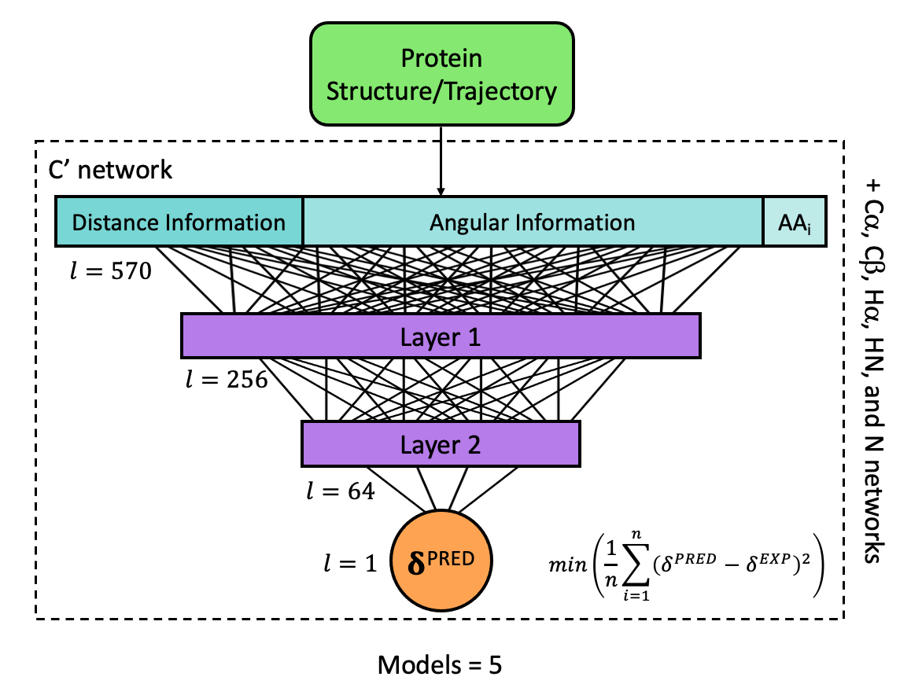

# LEGOLAS 🧝‍♀️🏹
A fast and accurate machine learning model built on PyTorch for predicting protein chemical shifts from PDB structures and molecular dynamics trajectories. This model is designed to be run on either CPUs or GPUs.



## Table of Contents
- [Installation](#installation)
- [Usage](#usage)
- [Contributing](#contributing)
- [License](#license)
- [Citation](#citation)

## Installation
1. Clone the repository using `--recursive` to include the required submodule:
```bash
 git clone --recursive https://github.com/mdarrows/legolas.git
 cd legolas
```
2. Set up a conda environment:
Use the provided legolas_env.yaml file to create the conda environment:
```bash
conda env create -n legolas -f legolas_env.yaml
conda activate legolas
```
Versions when installing using conda:

- python 3.10
- cuda 11.8
- pytorch 2.5.1

3. Install TorchANI:

**Within `external/internal-legolas-aev`:**

LEGOLAS is most efficient when run using the torchani compiled cuAEV extension, but it is not required.

You have two options, depending on whether you want to install the torchani compiled extensions. To install torchani with no compiled extensions run:

```bash
pip install --no-deps -v .
```

To install torchani with the cuAEV compiled extension run instead:

```bash
# Use 'ext-all-sms' instead of 'ext' if you want to build for all possible GPUs
pip install --config-settings=--global-option=ext --no-build-isolation --no-deps -v .
```

In both cases you can add the editable, `-e`, flag after the verbose, `-v`,
flag if you want an editable install (for developers). The `-v` flag can of
course be omitted, but it is sometimes handy to have some extra information
about the installation process.

## Usage

### To run LEGOLAS, use the following command:
```bash
# atypes = HA, H, CA, CB, C, N
python legolas.py {coordinates_file(s)} [-b {BATCH_SIZE}] [-atype {INTERESTED_ATYPES}] [-t {TOPOLOGY}]
```

### Examples:
```bash
# All atom types:
python legolas.py data/A001_1KF3A.pdbH

# Specfy atom types:
python legolas.py data/A001_1KF3A.pdbH -atype H,C,N

# Run on molecular dynamics trajectory:
python legolas.py data/{trajectory_file}.nc -t data/{topology_file}.parm7
```

## Contributing

If you find a bug or have some feature request, please feel free to open an issue on GitHub or send us a pull request.

## License
This project is licensed under the [MIT License](LICENSE).

## Citation

Please cite the following paper if you use LEGOLAS:

Mikayla Y. Darrows, Dimuthu Kodituwakku, Jinze Xue, Ignacio Pickering, and Adrian E. Roitberg. LEGOLAS: a machine learning method for rapid and accurate predictions of protein NMR chemical shifts.
